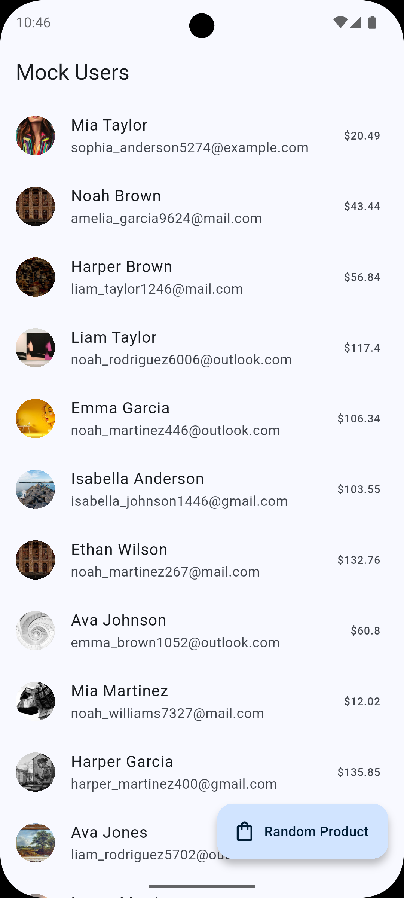
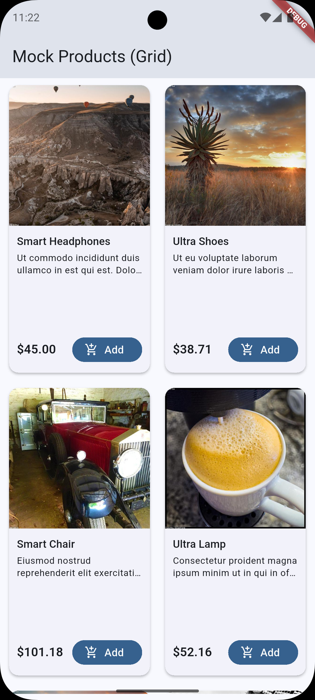

## flutter_mock_data

[](https://pub.dev/packages/flutter_mock_data)
[](https://pub.dev/packages/flutter_mock_data/score)
[](https://pub.dev/packages/flutter_mock_data)
[](https://github.com/prog-hussain5/flutter_mock_data)

Generate realistic mock data for Flutter apps: names, emails, phones, images, addresses, products, text, dates, and mock JSON responses. Arabic and English supported.

Source: [GitHub Repository](https://github.com/prog-hussain5/flutter_mock_data)

###  Features

- Names: `fullName()`, `firstName()`, `lastName()` (AR/EN)
- Emails: `email({String? domain})`
- Phone numbers: `phone({String? countryCode})`
- Locations: `city()`, `country()`, `address()`
- Images: `image({String? category, int width = 400, int height = 300})`
- Products: `productName()`, `price({double min, double max, int decimals})`, `description({int sentences})`
- Dates: `date({int rangeInDays = 365, bool inFuture = false})`
- Text: `lorem({int words})`, `arabicLorem({int words})`
- Mock API: `mockApiResponse()` returns a `Map<String, dynamic>`

Tip: Fill empty fields easily with `MockData.ensure(value, () => generator())`.

### Getting started

```dart
import 'package:flutter_mock_data/flutter_mock_data.dart';

void main() {
  // Optional: set default locale
  MockData.setLocale(MockLocale.en); // or MockLocale.ar

  final name = MockData.fullName();
  final email = MockData.email();
  final phone = MockData.phone();
  final img = MockData.image(category: 'people');
  final addr = MockData.address();
  final product = MockData.productName();
  final price = MockData.price();
  final desc = MockData.description();
  final when = MockData.date(rangeInDays: 30);
  final json = MockData.mockApiResponse();

  // Fill an empty value
  final safeTitle = MockData.ensure('', () => MockData.productName());
}
```

### UI example

```dart
ListView.builder(
  itemCount: 10,
  itemBuilder: (context, index) {
    return ListTile(
      leading: CircleAvatar(
        backgroundImage: NetworkImage(MockData.image(category: 'people')),
      ),
      title: Text(MockData.fullName()),
      subtitle: Text(MockData.email()),
    );
  },
);
```

<!-- Grid example removed per request -->

### Screenshots

Add screenshots from the example app for your README (optional):
1) Run the example app under `example/`
2) Take screenshots of the grid/products
3) Place them under `docs/screenshots/`
4) Reference them here:

```md


```

### API overview

- Locale: `MockData.setLocale(MockLocale.en|ar)`
- Names: `firstName()`, `lastName()`, `fullName()`
- Email: `email({domain})`
- Phone: `phone({countryCode})`
- Location: `city()`, `country()`, `address()`
- Images: `image({category, width, height})`
  - Supported categories (case-insensitive):
    - people, person, avatar, users
    - animals, cats, cat, dogs, dog
    - cars, car, motorcycles, motorcycle, bikes, bike
    - city, buildings, architecture
    - business, finance
    - fashion, sports, football, basketball
    - travel, beach, mountains, forest, nature, flowers
    - space, science, music, art
    - technology, tech, computer, phone
    - food, drinks, coffee
    - any (default)
- Products: `productName()`, `price({min, max, decimals})`, `description({sentences})`
- Dates: `date({rangeInDays, inFuture})`
- Text: `lorem({words})`, `arabicLorem({words})`
- Mock API: `mockApiResponse()`

### Contributing

Contributions are welcome. Open an Issue or Pull Request with your ideas.
